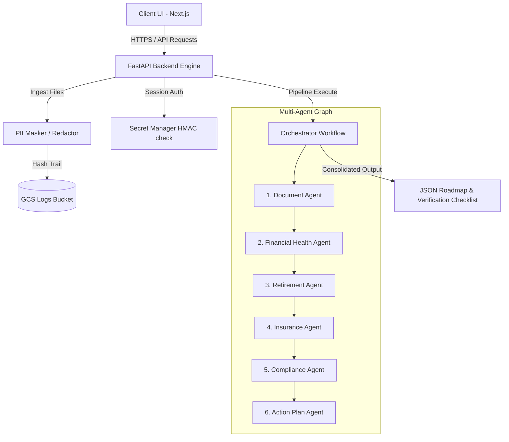

# 🛡️ Financial Life Copilot

> **Fiduciary Multi-Agent Copilot for Wealth Architecture & Compliance**
> Built for the Google Cloud & Vertex AI Agent Hackathon using the **Google Agent Development Kit (ADK)** & **Gemini Enterprise**.

---

## 1. Problem Statement
Managing personal finances, compliance limits (e.g., IRS Sec 401k), and insurance planning is fragmented and error-prone. Standard retail solutions offer generic templates, lack fiduciary safety checks, and force manual document comparisons. 

**Financial Life Copilot** resolves this by automating the ingestion of raw financial files (statements, W2s, payrolls), simulating long-term compounding growth in secure sandboxes, scanning insurance gaps, and synthesizing compliance-checked roadmap items under strict fiduciary guardrails.

---

## 2. Architecture Overview



---

## 3. Specialist Agent Design

Every node in our graph runs a specialized ADK-configured Agent:
1. **Document Intelligence Agent**: Parses uploaded CSV/PDF files using OCR models and formats metrics into a structured database profile.
2. **Financial Health Agent**: Computes dynamic KPIs (Net Worth, Debt-To-Income ratios, and Emergency liquidity months).
3. **Retirement Planning Agent**: Simulates compounding growth curves and Monte Carlo probability models.
4. **Insurance Gap Agent**: Evaluates coverage gaps for life, liability, and disability plans against net assets.
5. **Compliance & Responsible AI Agent**: Operates as a fiduciary guardrail ensuring zero hallucinated products are suggested and IRS contribution thresholds are enforced.
6. **Action Planning Agent**: Compiles recommendations into structured roadmap buckets: Immediate, 30-Day, 90-Day, and 1-Year roadmaps.

---

## 4. MCP (Model Context Protocol) Integrations

We interface with user environments via secure Model Context Protocol servers:
- **Google Drive MCP**: Ingests uploaded bank statements and W2 forms.
- **Google Sheets MCP**: Stores resolved compliance-checked data profiles.
- **Google Calendar MCP**: Schedules reminders automatically for approved roadmap items.

---

## 5. Fiduciary Security Features
- **Client-Side/Early PII Masking**: Redacts SSNs and Account numbers using session-salted keys before the LLM processing pipeline runs.
- **Audit Logging**: Structured JSON-Lines are generated for every tool/agent invocation and piped to **Google Cloud Logging**.
- **Interactive Approval Gates**: Any roadmap items flagged as "High" priority require the client's explicit Web UI interaction before execution.

---

## 6. Setup & Run Instructions

### Prerequisites
- Node.js >= 20.0
- Python >= 3.11
- GCP Project with enabled APIs (Vertex AI, Google Secrets Manager)

### Run Backend
```bash
cd backend
python3 -m venv .venv
source .venv/bin/activate
pip install -r pyproject.toml
uvicorn app.fast_api_app:app --reload --port 8000
```

### Run Frontend
```bash
cd frontend
npm ci
npm run dev
```
Open `http://localhost:3000` to interact with the Next.js portal.

---

## 7. Google Cloud Run Deployment

Deployment is managed via **Google Cloud Build** which provisions build parameters, tags containers, and injects runtime secret keys:

```bash
# Submit build configuration
gcloud builds submit --config=cloudbuild.yaml --substitutions=_LOGS_BUCKET_NAME="your-audit-logs-bucket"
```

---

## 8. Interactive Demo Flow
1. **Authentication Session**: The client receives a secure session token.
2. **Statement Upload**: Upload a demo tax W2 or bank statement file. The dashboard processes PII masking immediately.
3. **Trigger Pipeline**: Click the **Start Multi-Agent Analysis** trigger. Monitor progression from classification to reconciliation.
4. **Interactive Decisions**: Navigate to the **Financial Roadmap** and approve high-priority caught gaps.

---

## 9. Future Enhancements
- **Multi-Bank Plaid Integration**: Real-time asset syncing bypassing CSV statement reliance.
- **Agent-to-Agent Direct Trust Protocols**: Cryptographically signed handshakes between specialized nodes to prevent malicious prompt injection hijacking.
- **Self-Optimizing LLM Judges**: Continuous evaluation loops to test model drift on tax code alterations.
